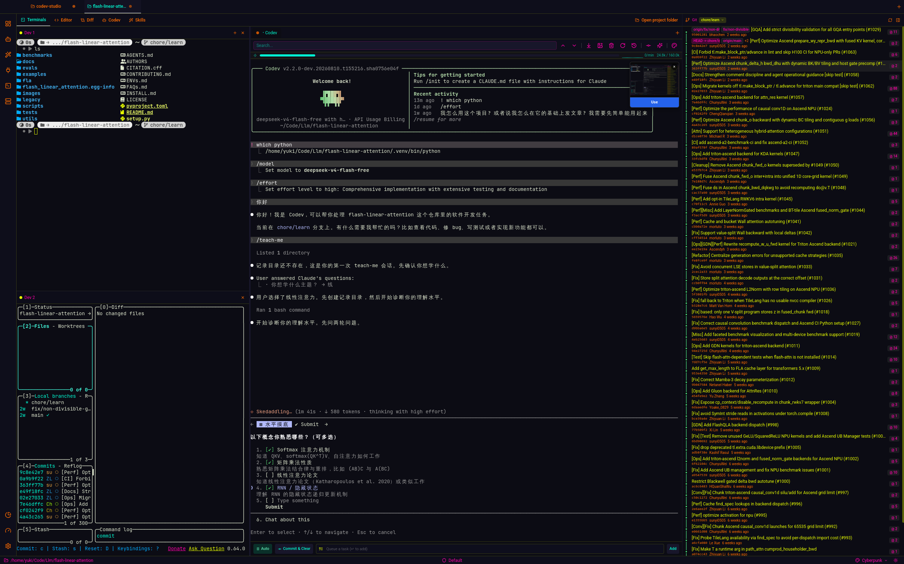

# Codev Studio: Co-Dev in IDE


<div align="center">
  
</div>

## 📢 News

- **2026-08-11** 🏷️ Renamed to **Codev Studio** — project rebranded from `vbcdr`, all Claude wording replaced with Codev across the app, and a Nerd Font-first terminal font stack with tighter line metrics to match system terminals.
- **2026-08-11** ⌨️ Linux IME & Clipboard Fixes — fcitx5 input now works in packaged builds, IME composition double-input is gone, and Ctrl+Shift+C/V copies/pastes in the terminal like a real terminal.
- **2026-08-08** 🚀 Provider Dropdown — LLM startup is now configured by picking Claude or Codex from a dropdown instead of a free-text command; settings labels are provider-neutral and Claude-only features are gated behind the provider setting.
- **2026-07-15** 🔌 MCP Servers Page — new management page for MCP servers, clipboard image thumbnails in the LLM terminal, a global terminal start folder setting, and reworked dashboard cards.
- **2026-07-12** ⚡ Faster Project Switching — Monaco projects are cached across switches, git loads are deduped, and refetch on re-register is skipped for snappier navigation.
- **2026-07-03** 🧱 Large-Repo Hardening — nested `.gitignore` files are respected, file tree size is capped, and readdir concurrency is bounded so big repos and submodules no longer crash.
- **2026-06-15** 📊 Transcript Token Usage — token usage is read straight from the Claude transcript with model-aware context caps, fixing decimal/suffix parsing; MCP permission rules are validated, the PTY output buffer is capped at 4 MB, and a version-history recommendation shows when `~/.claude` has no git repo.
- **2026-06-12** 🔄 Git Revert & Binary Diffs — git revert-to-HEAD, binary diff previews with NUL sniffing, and fixes for rename status parsing and Monaco diff model disposal; 8 verified bugs fixed from an architecture review and god components refactored into focused modules.
- **2026-05-27** 🧹 Memory Leak Fixes — leaks in the file watcher, Monaco loader, and terminal scrollback (plus fseventsd churn on macOS) eliminated.
- **2026-05-26** 🕘 Session History — Claude session history modal per terminal, click-to-jump on terminal output, drag-to-`@`-mention from the sidebar, image thumbnail previews, and sessions always resume in a new tab.
- **2026-05-24** 🔎 Project Search — project-wide search panel with per-project folder excludes; project files are fed into the Monaco TS worker so imports resolve in the editor.
- **2026-05-23** 📈 Live Git Graph — git graph auto-refreshes on ref changes, pull/push/rebase errors are surfaced, and removing a project cascades per-project cleanup.
- **2026-05-21** 📊 Analytics — configurable min-session-duration filter, ANSI-only output filtered out, and single-event sessions dropped; the Claude page gets its own LLM terminal with full panel chrome.
- **2026-05-11** 🧠 AI Code Review — inline AI code review via git diffs; README rewritten to match current features.

<details>
<summary>Earlier news</summary>

- **2026-05-05** 🛡️ Stability Hardening — `safeHandle` IPC wrapper logs all handler errors, panels and app root are wrapped in error boundaries with reload recovery, filesystem IPC is async so the event loop never blocks, and dev server cards show CPU/memory with a Windows fallback.
- **2026-05-04** 🌿 Git Worktrees — each LLM terminal runs in an isolated git worktree with intro/manage modal and auto-merge controls; added the dev servers page (list local listeners with kill/open), Explain changes on diffs with inline annotations, and a configurable LLM startup command.
- **2026-05-02** 🧩 Global Pages — global Claude and Skills sidebar pages, scoped per-project tabs, skills.sh top list with install buttons, permission presets with per-project buttons, and git push via the system credential helper.
- **2026-05-01** 🎨 Appearance — background override settings with transparent terminals; task queue defaults and auto-run controls; embedded browser, devtools, and password manager removed to focus on the IDE workflow.
- **2026-04-27** 🎨 App icon updated (white frame removed).
- **2026-04-24** 🗓️ History & Diff — always-on diff overlay with commit, per-file include toggle and line jump, commit panel toggle, timeline view, historical work card with per-project heatmaps, and pulsating project tab when the inactive LLM terminal goes idle.
- **2026-04-23** 🧰 Editor & Queue — Skills marketplace tab with per-scope install, command palette with actions and prompt-to-queue input, task queue as an inline composer with chips, Usage page with token velocity sparkline, and editor settings for minimap, font/tab size, autosave, format-on-save, bracket pair colorization, and drag-to-reorder tabs.
- **2026-03-23** 📁 File Tree Operations — delete, rename, new, duplicate and search on the file tree; docx preview fixes.
- **2026-03-19** 🎨 Custom Theme — live theme editor with picker portals; release script auto-bumps and tags versions.
- **2026-03-12** 📊 Dashboard — project cards with live terminal output, token usage progress bar, auto-updater with silenced 404s, and dashboard cards sorted by last activity.
- **2026-03-11** 🏠 Dashboard View — project cards with terminal output buffer; terminal context preserved across dashboard switches.
- **2026-02-12** 🏷️ Renamed to `vbcdr`.
- **2026-02-11** 🚀 Open-Source Release — MIT license, screenshots, roadmap; draggable grid layout with react-grid-layout and dnd-kit, file drag-and-drop into terminals, and a reset-layout button.
- **2026-02-08** 🎉 VibeCoder born — initial implementation with terminal, file tree, browser preview, Monaco editor, git commit tree with SVG branch graph, light/dark GitHub themes, webview browser tabs with persistence, password manager, devtools, and a quick commit button.

</details>

## 📦 Install

```bash
# source install
git clone https://github.com/chenbhao/codev-studio.git && cd codev-studio && npm install && npm run dev
```

## 🚀 Quick Start

```bash
# test suite
npm test
```

Build a distributable:
```bash
npm run build:mac   # macOS arm64 dmg + zip
npm run build:linux # Linux AppImage + deb
npm run build:win   # Windows NSIS installer
```
